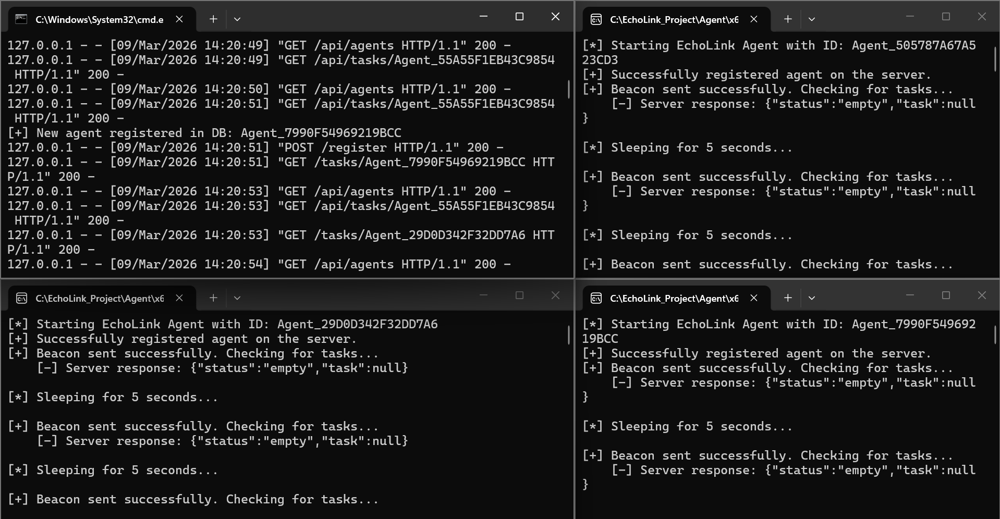
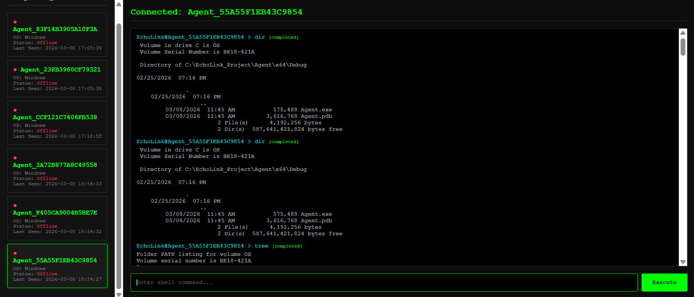
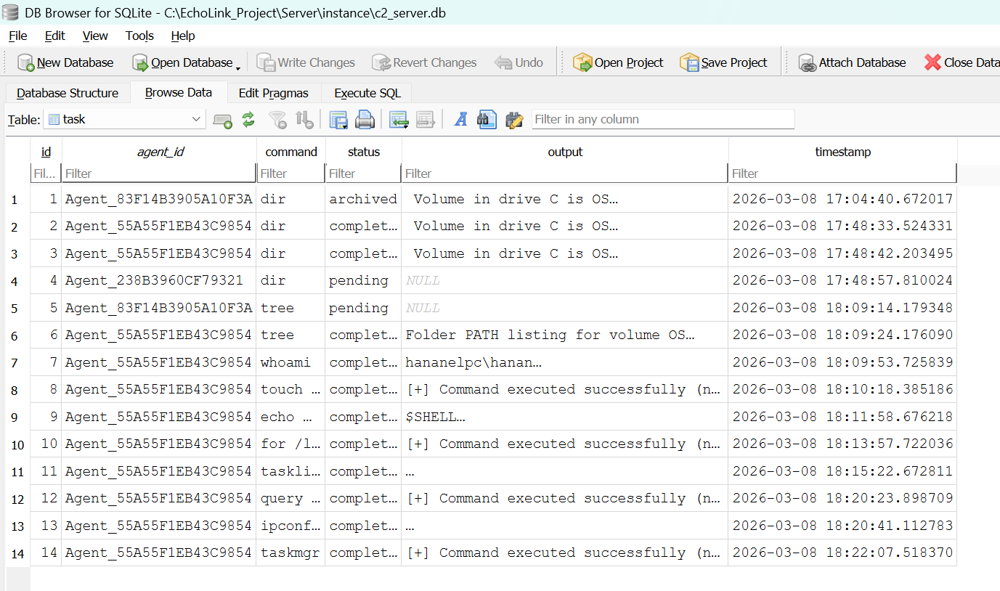

# EchoLink C2 Framework 🛡️

A custom, lightweight Command and Control (C2) framework designed to demonstrate asynchronous communication between a central web dashboard and native Windows C++ agents.



> **Disclaimer:** This project was developed strictly for educational purposes, security research, and authorized testing. Do not use this software on systems where you do not have explicit permission.

---

## 🚀 Features

* **Asynchronous C2 Architecture:** Implements a pull-based beaconing mechanism, eliminating the need for open ports on the target machine.
* **Native Windows Agent:** Written in C++ utilizing the native `WinHTTP` API for stealthy, low-level network communication.
* **Secure Operator Dashboard:** A Vanilla JS Single Page Application (SPA) secured with JSON Web Tokens (JWT) to prevent unauthorized access.
* **RESTful Python Backend:** Built with Flask and SQLAlchemy (SQLite) serving as the central State Machine and data broker.
* **Real-Time Terminal UI:** Features a dynamic, auto-scrolling terminal interface for executing commands and viewing outputs seamlessly.

---

## 🧠 Architecture Overview

The framework operates on a decoupled architecture, ensuring the operator and the target never communicate directly:

1. **The Agent (C++):** Runs on the target Windows machine. It registers itself with the server and periodically polls (beacons) the `/tasks/<agent_id>` endpoint to retrieve pending commands.
2. **The Server (Python/Flask):** Acts as the intermediary. It validates operator JWTs, stores commands in the SQLite database as `pending`, and updates them to `completed` once the agent posts the execution results back.
3. **The Dashboard (JS/HTML):** The operator's interface. It continuously polls the secure API to provide a real-time view of online agents and their execution history.

---

## 🛠️ Tech Stack

* **Backend:** Python 3, Flask, SQLAlchemy, PyJWT
* **Frontend:** HTML5, CSS3, Vanilla JavaScript (Fetch API)
* **Agent:** C++, Windows API (WinAPI), WinHTTP
* **Database:** SQLite

---

## ⚙️ Getting Started

### Prerequisites
* Python 3.8+
* Visual Studio 2019/2022 (with C++ Desktop Development workload)

### 1. Server Setup
Clone the repository and set up the Python environment:
```bash
git clone https://github.com/hananelk26/EchoLink-C2-Framework.git
cd EchoLink-C2-Framework/Server
```
### Install required dependencies
```bash
pip install flask flask-sqlalchemy pyjwt
```

### Run the C2 Server
```bash
python app.py
```
### The server will initialize the SQLite 
database automatically and listen on `http://0.0.0.0:5000`.

### 2. Agent Compilation
1. Open `Agent.sln` in Visual Studio.
2. Set the build configuration to **Release | x64**.
> **Note:** Ensure the IP address in the `Agent.cpp` WinHTTP configuration matches your C2 server's IP.
3. Build the solution. The compiled `.exe` will be generated in the `x64/Release` folder.

## 💻 Usage
1. Open your web browser and navigate to `http://localhost:5000`.
2. Log in using the default operator credentials (configurable in `app.py`).
3. Execute the compiled C++ Agent on a Windows machine.
4. The agent will appear as **Online** in the left sidebar.
5. Select the agent and use the terminal interface to send standard Windows CMD commands (e.g., `whoami`, `ipconfig`, `dir`).

## 🔒 Security Considerations
Currently, the agent communication is performed over standard HTTP (Plaintext). Future iterations will include XOR-based payload encryption and HTTPS (TLS) support for evasion and secure transit.
